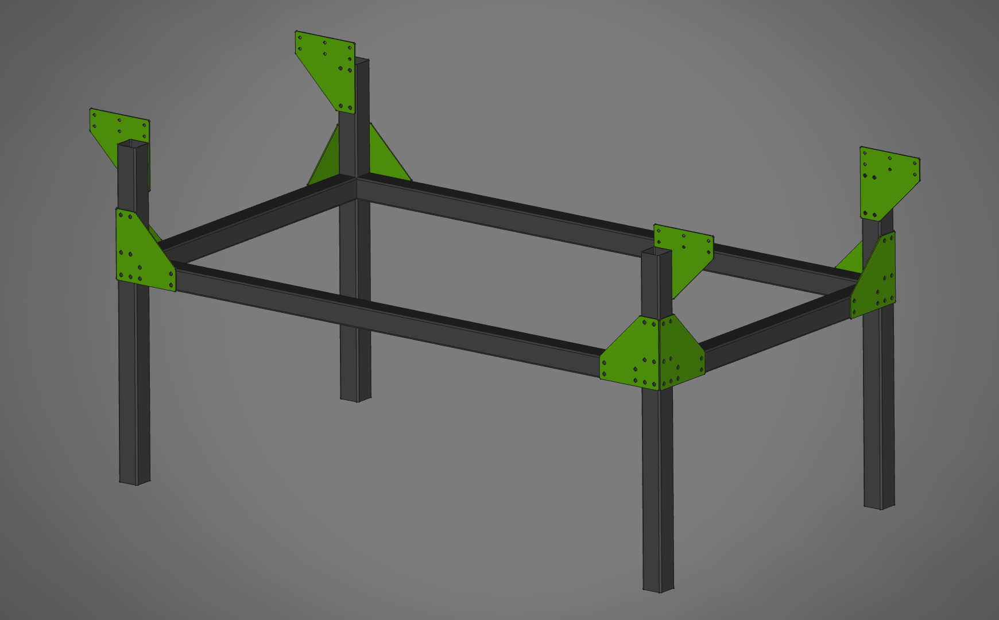

# Подстолье для станка 5CNC-Мастер

Файлы для самостоятельного изготовления опорных косынок.

[gusset-top-20250329.dxf](https://raw.githubusercontent.com/5CNC/master/refs/heads/main/v5/base/gusset-top-20250329.dxf.zip) – верхняя косынка. Отверстия под крепеж к конструкционному профилю 8мм, отверстия под крепеж к ногам – 10мм.

[gusset-mid-20250329.dxf](https://raw.githubusercontent.com/5CNC/master/refs/heads/main/v5/base/gusset-mid-20250329.dxf.zip) – 
